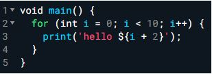
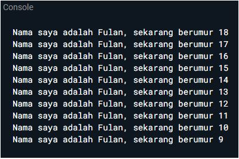
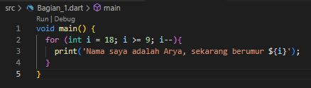
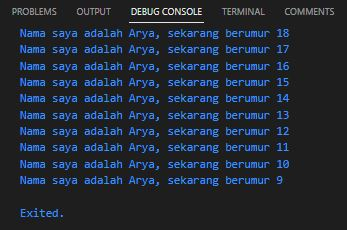

# Pemrograman Mobile - Pertemuan 2

NIM : 2141720207

Nama : Arya Wicaksana Hidayat

Tampilan Scrensshot :

# Soal 1

Modifikasilah kode pada baris 3 di VS Code atau Editor Code favorit Anda berikut ini agar mendapatkan keluaran (output) sesuai yang diminta!

Output yang diminta :

jawaban :

code :

hasil :

# Soal 2

Mengapa sangat penting untuk memahami bahasa pemrograman Dart sebelum kita menggunakan framework Flutter ? Jelaskan!

jawaban : Semua pengembangan framework Flutter melibatkan pengetahuan/fitur mendalam dengan bahasa Dart; Kode aplikasi, kode plugin, dan manajemen dependensi semuanya menggunakan bahasa Dart beserta fitur-fiturnya. Memiliki pemahaman dasar yang kuat tentang Dart akan memudahkan kita untuk menjadi lebih produktif dengan Flutter dan akan membuat merasa nyaman dalam pengembangan Flutter.

# Soal 3

Rangkumlah materi dari codelab ini menjadi poin-poin penting yang dapat Anda gunakan untuk membantu proses pengembangan aplikasi mobile menggunakan framework Flutter.

jawaban : 

Proses pengembangan aplikasi mobile menggunakan framework Flutter

-Perencanaan dan Desain: Tahap pertama adalah merencanakan aplikasi Anda dan membuat desain UI/UX. Anda harus memiliki pemahaman yang jelas tentang tujuan aplikasi, audiens target, dan fitur-fitur yang akan disertakan.

-Pengaturan Lingkungan Pengembangan: Instalasi Flutter dan Flutter SDK adalah langkah pertama. Anda juga perlu menginstal Android Studio atau Xcode (untuk pengembangan iOS) serta konfigurasi perangkat virtual atau fisik untuk menguji aplikasi Anda.

-Pemrograman: Anda akan menggunakan bahasa pemrograman Dart untuk mengembangkan aplikasi Flutter. Anda akan membuat berbagai widget dan komponen UI, mengelola keadaan aplikasi, dan mengimplementasikan logika bisnis.

-Penggunaan Widget: Flutter adalah framework yang sangat widget-centric. Anda akan menggunakan widget untuk membangun antarmuka pengguna Anda. Flutter menyediakan berbagai jenis widget, termasuk widget dasar seperti Text, Image, dan Button, serta widget kustom yang dapat Anda buat sendiri.

-Manajemen Keadaan: Flutter memiliki sistem manajemen keadaan yang kuat dengan State Management, seperti Provider, Bloc, atau GetX. Anda harus memilih yang sesuai dengan kebutuhan aplikasi Anda dan menggunakannya untuk menyimpan dan mengelola data aplikasi.

-Kompilasi dan Pengujian: Anda perlu mengompilasi aplikasi Anda untuk menghasilkan file APK (Android) atau IPA (iOS) untuk pengujian. Flutter memiliki alat bawaan seperti flutter run yang memungkinkan Anda menjalankan aplikasi pada emulator atau perangkat fisik.

-Pengujian dan Debugging: Uji aplikasi Anda pada berbagai perangkat dan resolusi untuk memastikan tampilan dan kinerjanya sesuai dengan harapan. Gunakan alat Flutter seperti DevTools dan Flutter Inspector untuk debugging.

-Optimasi Kinerja: Selama pengembangan, Anda perlu memantau dan mengoptimasi kinerja aplikasi. Ini bisa termasuk mengurangi pemakaian memori, mengoptimalkan gambar, dan menghindari masalah yang dapat mempengaruhi responsivitas aplikasi.

-Dokumentasi: Buat dokumentasi yang baik untuk kode Anda. Ini akan membantu Anda dan tim Anda memahami bagaimana aplikasi bekerja dan mempermudah pemeliharaan di masa depan.

-Penerbitan Aplikasi: Setelah Anda puas dengan aplikasi Anda dan telah menguji dengan baik, Anda dapat menerbitkannya di Google Play Store (Android) dan Apple App Store (iOS). Ini melibatkan langkah-langkah seperti pengiriman aplikasi, pengujian beta, dan persetujuan dari platform masing-masing.

-Pemeliharaan dan Pengembangan Berkelanjutan: Setelah aplikasi diluncurkan, Anda harus siap untuk memelihara dan mengembangkannya lebih lanjut dengan pembaruan, penambahan fitur, dan perbaikan bug berdasarkan umpan balik pengguna.