# Pemrograman Mobile - Pertemuan 3

NIM : 2141720207

Nama : Arya Wicaksana Hidayat

Tampilan Scrensshot :

# Praktikum 1

# Langkah 1

Ketik atau salin kode program berikut ke dalam fungsi main().

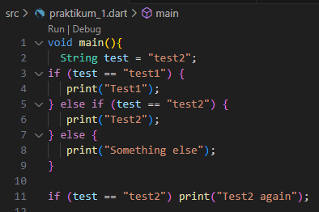

# Langkah 2

Silakan coba eksekusi (Run) kode pada langkah 1 tersebut. Apa yang terjadi? Jelaskan!

keduanya berhasil di run karena String menunjuk ke "test2"

# Langkah 3

Apa yang terjadi ? Jika terjadi error, silakan perbaiki namun tetap menggunakan if/else.

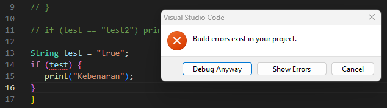

fixed :

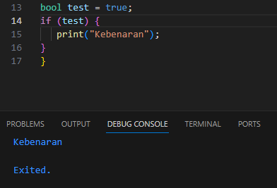

# Praktikum 2

# Langkah 1

Ketik atau salin kode program berikut ke dalam fungsi main().

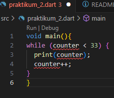

# langkah 2

Silakan coba eksekusi (Run) kode pada langkah 1 tersebut. Apa yang terjadi? Jelaskan! Lalu perbaiki jika terjadi error.

terjadi error karena variable counter tidak mempunyai nilai

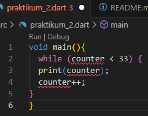

fixed :

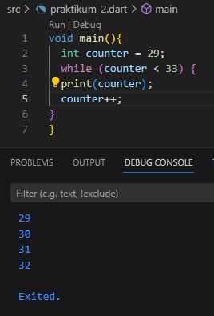

# Langkah 3

Apa yang terjadi ? Jika terjadi error, silakan perbaiki namun tetap menggunakan do-while.

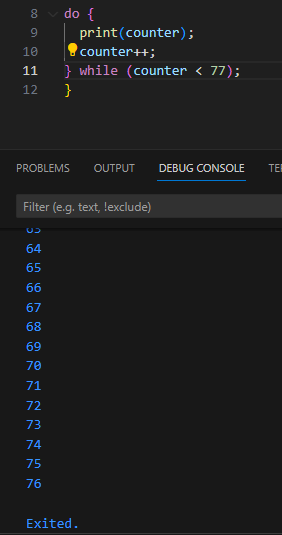

# Praktikum 3

# langkah 1

Ketik atau salin kode program berikut ke dalam fungsi main().

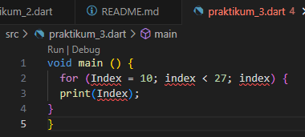

# Langkah 2

Silakan coba eksekusi (Run) kode pada langkah 1 tersebut. Apa yang terjadi? Jelaskan! Lalu perbaiki jika terjadi error.

variable index tidak ada

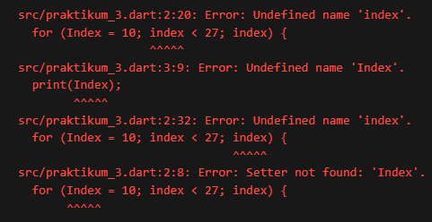

fixed :

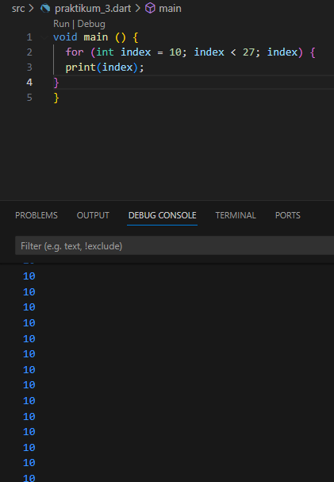

# Langkah 3

Tambahkan kode program berikut di dalam for-loop, lalu coba eksekusi (Run) kode Anda.

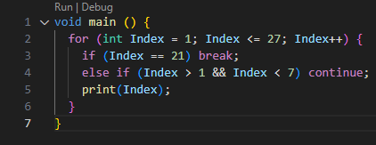

Apa yang terjadi ? Jika terjadi error, silakan perbaiki namun tetap menggunakan for dan break-continue.

hasilnya akan berhenti di 1 dan melanjutkan dari angka 7 hingga selesai

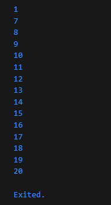
