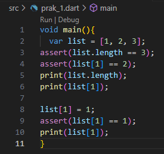
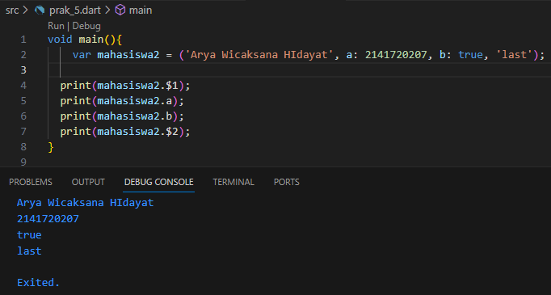

# Pemrograman Mobile - Pertemuan 4

NIM : 2141720207

Nama : Arya Wicaksana Hidayat

Tampilan Scrensshot :

# Praktikum 1 : Eksperimen Tipe Data Set

# Langkah 1 

Ketik atau salin kode program berikut ke dalam void main().

# Langkah 2

Silakan coba eksekusi (Run) kode pada langkah 1 tersebut. Apa yang terjadi? Jelaskan!

jelaskan : menginisialisasi list berisi tiga angka, pertama memeriksa dan print panjang list (hasil = 3) beserta nilai dari elemen kedua (hasil = 3 dan 2). setelah melakukan perubahan list kedua (baris ke-1 yang tadinya 2 jadi 1) maka hasil print nya itu menjadi 3 2 1

# Langkah 3

Ubah kode pada langkah 1 menjadi variabel final yang mempunyai index = 5 dengan default value = null. Isilah nama dan NIM Anda pada elemen index ke-1 dan ke-2. Lalu print dan capture hasilnya.

# Praktikum 2: Eksperimen Tipe Data Set

# Langkah 1

Ketik atau salin kode program berikut ke dalam fungsi main().

# Langkah 2

Silakan coba eksekusi (Run) kode pada langkah 1 tersebut. Apa yang terjadi? Jelaskan! Lalu perbaiki jika terjadi error.

variabel yang bernama "halogens" yang berisi unsur-unsur, saat mencetak variabel "halogens" maka akan mencetak isi di dalamnya

# Langkah 3

Tambahkan kode program berikut, lalu coba eksekusi (Run) kode Anda.

Apa yang terjadi ? Jika terjadi error, silakan perbaiki namun tetap menggunakan ketiga variabel tersebut. Tambahkan elemen nama dan NIM Anda pada kedua variabel Set tersebut dengan dua fungsi berbeda yaitu .add() dan .addAll(). Untuk variabel Map dihapus, nanti kita coba di praktikum selanjutnya.

# Praktikum 3: Eksperimen Tipe Data Maps

# Langkah 1

Ketik atau salin kode program berikut ke dalam fungsi main().

# Langkah 2

Silakan coba eksekusi (Run) kode pada langkah 1 tersebut. Apa yang terjadi? Jelaskan! Lalu perbaiki jika terjadi error.

Variabel gifts menyimpan objek dengan tiga properti: first, second, dan fifth. Properti first memiliki nilai "partridge", properti second memiliki nilai "turtledoves", dan properti fifth memiliki nilai 1. Variabel nobleGases menyimpan objek dengan tiga properti: 2, 10, dan 18. Properti 2 memiliki nilai "helium", properti 10 memiliki nilai "neon", dan properti 18 memiliki nilai 2

# Langkah 3

Tambahkan kode program berikut, lalu coba eksekusi (Run) kode Anda.

Apa yang terjadi ? Jika terjadi error, silakan perbaiki.

jelaslan : setelah penambahan kode, hasilnya tetap sama

Tambahkan elemen nama dan NIM Anda pada tiap variabel di atas (gifts, nobleGases, mhs1, dan mhs2).

hasil :

# Praktikum 4: Eksperimen Tipe Data List: Spread dan Control-flow Operators

# Langkah 1

Ketik atau salin kode program berikut ke dalam fungsi main().

# Langkah 2

Silakan coba eksekusi (Run) kode pada langkah 1 tersebut. Apa yang terjadi? Jelaskan! Lalu perbaiki jika terjadi error.

karena tadi mengalami error dengan kesalahan variabel pada "list", maka saya perbaiki dengan menjadikan "list1"

# Langkah 3

Tambahkan kode program berikut, lalu coba eksekusi (Run) kode Anda.

Apa yang terjadi ? Jika terjadi error, silakan perbaiki.

fixed :

Tambahkan variabel list berisi NIM Anda menggunakan Spread Operators. Dokumentasikan hasilnya dan buat laporannya!

# Langkah 4

Tambahkan kode program berikut, lalu coba eksekusi (Run) kode Anda.

Apa yang terjadi ? Jika terjadi error, silakan perbaiki. Tunjukkan hasilnya jika variabel promoActive ketika true dan false.

fixed :

# Langkah 5

Tambahkan kode program berikut, lalu coba eksekusi (Run) kode Anda.

Apa yang terjadi ? Jika terjadi error, silakan perbaiki. Tunjukkan hasilnya jika variabel login mempunyai kondisi lain.

fixed :

# Langkah 6

Tambahkan kode program berikut, lalu coba eksekusi (Run) kode Anda.

Apa yang terjadi ? Jika terjadi error, silakan perbaiki. Jelaskan manfaat Collection For dan dokumentasikan hasilnya.

Dalam contoh kode Dart tersebut, ekspresi "collection for" digunakan untuk membuat daftar listOfStrings dengan mengiterasi melalui elemen-elemen dalam listOfInts dan menggabungkannya dengan tanda pagar (#). Hasilnya adalah listOfStrings yang berisi ['#1', '#2', '#3']. Selanjutnya, kode memeriksa apakah elemen kedua dalam listOfStrings adalah '#2' menggunakan pernyataan assert. Terakhir, isi dari listOfStrings dicetak ke konsol.

# Praktikum 5: Eksperimen Tipe Data Records

# Langkah 1 

Ketik atau salin kode program berikut ke dalam fungsi main().

# Langkah 2

Silakan coba eksekusi (Run) kode pada langkah 1 tersebut. Apa yang terjadi? Jelaskan! Lalu perbaiki jika terjadi error.

fixed :

# Langkah 3

Tambahkan kode program berikut di luar scope void main(), lalu coba eksekusi (Run) kode Anda.

Apa yang terjadi ? Jika terjadi error, silakan perbaiki. Gunakan fungsi tukar() di dalam main() sehingga tampak jelas proses pertukaran value field di dalam Records.

# Langkah 4

Tambahkan kode program berikut di dalam scope void main(), lalu coba eksekusi (Run) kode Anda.

Apa yang terjadi ? Jika terjadi error, silakan perbaiki. Inisialisasi field nama dan NIM Anda pada variabel record mahasiswa di atas

fixed :

# Langkah 5

Tambahkan kode program berikut di dalam scope void main(), lalu coba eksekusi (Run) kode Anda.

Apa yang terjadi ? Jika terjadi error, silakan perbaiki. Gantilah salah satu isi record dengan nama dan NIM Anda

# Tugas Praktikum

1. Silakan selesaikan Praktikum 1 sampai 5, lalu dokumentasikan berupa screenshot hasil pekerjaan Anda beserta penjelasannya!

2. Jelaskan yang dimaksud Functions dalam bahasa Dart!

Functions adalah sebuah blok kode yang dapat digunakan kembali. Sebuah fungsi dapat memiliki parameter atau tidak. Fungsi dapat mengembalikan nilai atau tidak. Fungsi dapat memiliki tipe kembalian atau tidak.

3. Jelaskan jenis-jenis parameter di Functions beserta contoh sintaksnya!

-Named Parameter, Named parameter adalah parameter yang diberi nama. Named parameter dapat diberikan nilai default. Named parameter dapat diberikan nilai default dengan menggunakan =

contoh :

    void main() {
        void greet(String name) {
        print('Hello, $name!');
        }
    
    greet('Neuvilette');  
    }

output :

    Hello, Neuvilette!

-Optional named parameter adalah named parameter yang diberi nilai default.

contoh

        void main() {
                void greet({String name = 'World'}) {
                        print('Hello, $name!');
                        }
                    // Memanggil fungsi greet dengan parameter opsional
                    greet(name: 'Luocha'); // Output: Hello, Luocha!
                    greet(); // Output: Hello, World!
        }

output

    Hello, Luocha!
    Hello, World!

-Required positional parameter adalah positional parameter yang tidak diberi nilai default.

contoh

    void main() {  
            String say(String from, String msg) {    
                var result = '$from says $msg';  
                return result;
                }
            }

calling

    say('Kokomi', 'Hi');

-Optional positional parameter adalah positional parameter yang diberi nilai default.

contoh

    void main() {
    String say(String from, String msg, [String? device]) {
        var result = '$from says $msg';
        if (device != null) {
        result = '$result with a $device';
        }
        return result;
    }
    }

calling

    say('Nahida', 'Greetings');
    say('Nahida', 'Greetings', 'archon signal');

4. Jelaskan maksud Functions sebagai first-class objects beserta contoh sintaknya!

Fungsi yang dianggap sebagai objek first-class dapat disimpan dalam variabel, digunakan sebagai argumen saat memanggil fungsi lain, dan bahkan dikembalikan sebagai hasil dari fungsi lainnya.

contoh

    void main() {
    var say = (String from, String msg, [String? device]) {
        var result = '$from says $msg';
        if (device != null) {
        result = '$result with a $device';
        }
        return result;
    };

    print(say('Nahida', 'Greetings'));
    print(say('Nahida', 'Greetings', 'archon signal'));
    }

5. Apa itu Anonymous Functions? Jelaskan dan berikan contohnya!

Fungsi anonim adalah jenis fungsi yang tidak memiliki nama. Fungsi anonim dapat disimpan dalam variabel, digunakan sebagai argumen saat memanggil fungsi lain, dan bahkan dikembalikan sebagai hasil dari fungsi lainnya.

contoh

    void main() {
    var list = ['apples', 'bananas', 'oranges'];
    list.forEach((item) {
        print('${list.indexOf(item)}: $item');
    });
    }

6. Jelaskan perbedaan Lexical scope dan Lexical closures! Berikan contohnya!

-Lexical scope adalah konsep dalam pemrograman yang mengatur bagaimana variabel dapat diakses dalam kode, dengan dasar pada struktur kode dan kurung kurawal. Ini berarti variabel hanya dapat diakses dalam cakupan di mana mereka didefinisikan, dari level terdalam hingga level tertinggi dalam struktur kode.

-lexical closure adalah kemampuan fungsi untuk tetap memiliki akses ke variabel-variabel dari cakupannya, bahkan ketika fungsi tersebut digunakan di luar cakupan asalnya. Ini berarti fungsi dapat "menangkap" variabel-variabel dari sekitarnya dan menggunakannya ketika dipanggil di tempat lain dalam kode. Jadi, lexical closure adalah tentang kemampuan fungsi untuk menjaga hubungan dengan variabel-variabel dari lingkungan di mana mereka dibuat, bahkan saat digunakan di lokasi yang berbeda.

7. Jelaskan dengan contoh cara membuat return multiple value di Functions!

Untuk membuat return multiple value di Functions, kita dapat menggunakan Record.

contoh

    (String, int) getData() {
    return ('Arya Wicaksana Hidayat', 2141720207);
    }

    void main() {
    var (nama, nim) = getData();

    print(nama);
    print(nim);
    }

8. Kumpulkan berupa link commit repo GitHub pada tautan yang telah disediakan di grup Telegram!